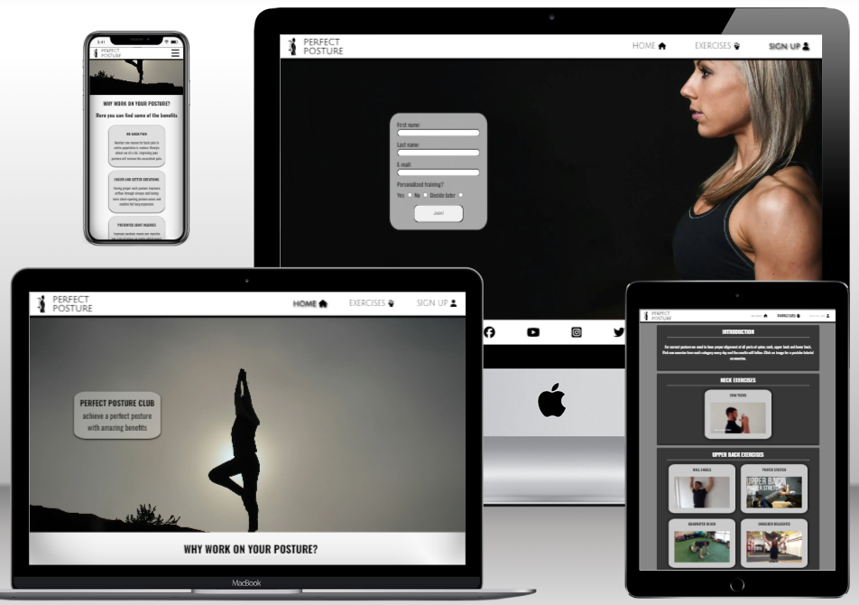
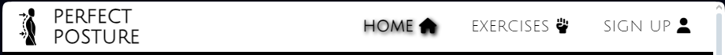
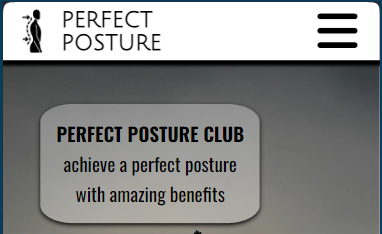
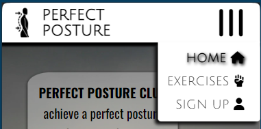
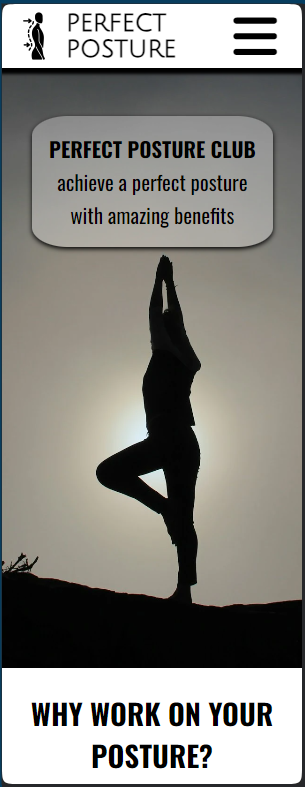
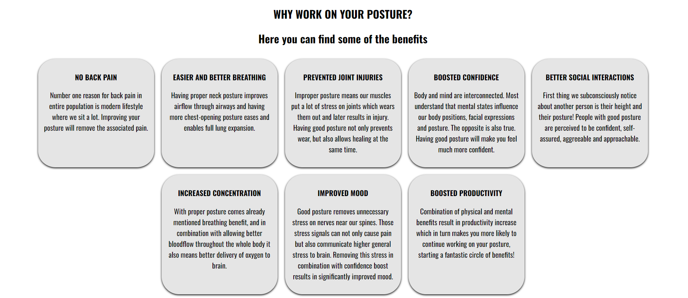
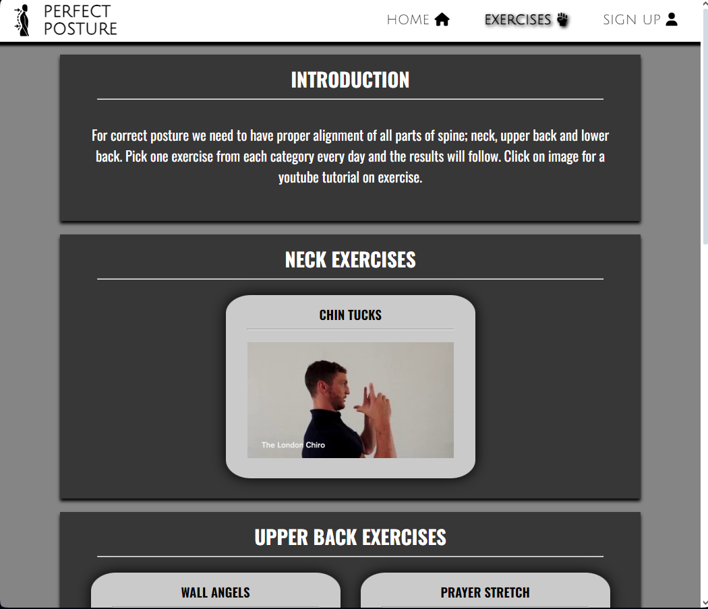
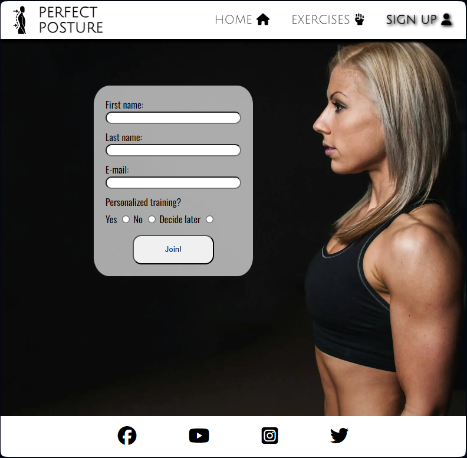
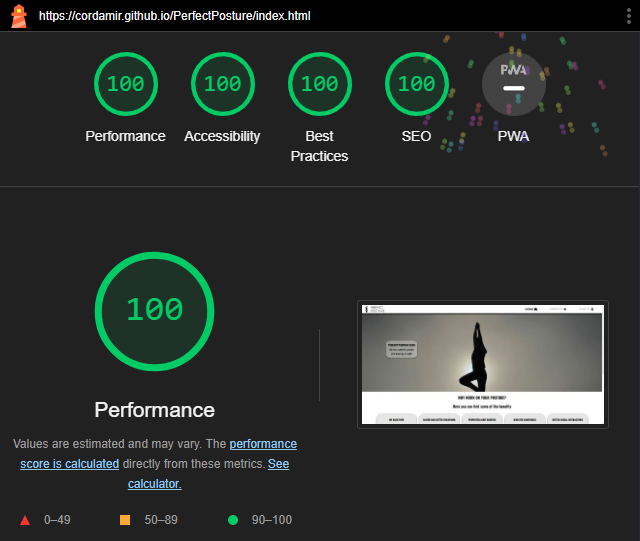

# Perfect Posture

"Perfect Posture" is a simple, informative and motivating website encouraging users to start and continue working on their postures. Targeting all users of PCs, laptops, tablets and smartphones as those are primary causes of suboptimal posture by using a website that displays on those same devices! Benefits are plentiful and amazing, they greatly improve quality of life and take less than ten minutes a day following simple structured exercise advice on Perfect Posture.

 

 ## FEATURES

  ### HEADER

  

  Top of the page always contains a header with logo on the left and navigation on the right providing consistency and intuitive navigation as well as hinting on general black and white color scheme of entire site.

  **Navigation**

  Navigation on header is responsive to screen width. For smartphones it's a user-expected standard menu icon that rotates and displays links menu. For wider display devices it's a menu bar as visible above. Logo will bring users to homepage as well.

  

  

  ### FOOTER

  Footer follows the same black and white color scheme, provides links to social media sites, appearing on the bottom after scrolling through entire content and reinforcing feeling of consistency.

  

  ### HOME PAGE

  **Landing image**

  

  Visiting Perfect Posture will first provide a view of a theme-fitting black and white image of a woman silhouette with good posture in exercise position. On the image is a rounded-edge card-type element drawing specific attention to itself with motivating text. Image is set to specific height revealing large text below indicating the reasons to use the page are below and encouraging users to scroll and read.

  **Reasons section**

  

  Scrolling down users can find fantastic benefits separated into card-like elements with shadows which is consistent with text on landing image and general theme of entire site. Cards contain bigger bold text drawing user attention to what speaks most to them and a short explanation how working on posture will achieve that. Motivated yet? Let's head over to exercises page.

  ### EXERCISES PAGE

  This page contains a very short introduction on how to use it, working with infamously short attention span of smartphone users and in that way encouraging a start. It uses consistent black and white theme only resorting to shades of gray and also consistent shadow casting card-like elements to divide sections and exercises in those sections. Everything is centered. Clean and clear, intuitive design is the way to go! Users can easily recognize which content belongs to which section.

  

  ### SIGN-UP PAGE

  Consistent with rest of the site, this page has a fitting image of a woman with great posture on black background and a card-like element with sign up form clearly drawing attention to itself.

  

  ### INTUITION, CONSISTENCY AND RESPONSIVENESS

  Entire site uses consistent color scheme and content separation design providing clean and clear look. In addition it is fully responsive across all screen displays and very intuitive to use.

  ### FUTURE FEATURES

  - add more exercises and a random daily generator; a feature that picks random exercise from each section and presents it to user as daily workout

  - implement offer to design personalized training and group sessions

  - implement community page where signed up users can share progress and advice

  - add educational page with information on exact muscle-bone interactions and why exercises work

 

## BUGS

  ### FIXED DURING TESTING

  | PROBLEM | FIX |
  | - | - | 
  | fontawesome script tag error on html validation | move script tag from html element to body element  |
  | stray html tag on html validation | remove unnecessary /p element |
  | links to lower back exercises opening on same page  | add target=_"blank" to a elements |
  | preconnection to fontawesome not working from deployed site | add crossorigin attribute to preconnect |
  | links in footer not satisfying accessibility standard | add aria-labels to links | 
  |  | | 

  ### CURRENT BUGS

  No bugs after testing phase, all features work as intended!

   

## FINAL TESTING INFORMATION

  ### MANUAL USAGE TEST

  Usage test was done on android phone and iPad. On PC it was done using chrome, opera, edge and firefox.

  | Test | Result |
  |-|-|
  |touch/click on logo | opened home page|
  |touch/click on menu icon | icon rotated, menu displayed |
  |touch/click on each menu item | opens desired page, active page appropriately marked|
  |scroll page | header always on top, footer on scroll end|
  |resize viewport on each page | menu change at appropriate width, all elements on all pages align as intended|
  |touch/click social media icons in footer | opened desired page in new tab|
  |touch/click exercise thumbnail | opened appropriate youtube video in new tab|
  |form submit with no first name | form asked to fill in name field|
  |form submit with no last name | form asked to fill in last name field|
  |form submit with no e-mail | form asked to fill in e-mail field|
  |form submit with incorrect e-mail structure | form asked to have "@" in e-mail field|
  |form submit without radio button selection | form asked to select one of the options|
  |proper form submit | information successfully transfered| 
  |||

  ### HTML VALIDATION

  All pages verified with no errors with [W3C HTML validator](https://validator.w3.org/nu/).

  ### CSS VALIDATION

  CSS code verified with no errors with [W3C CSS validator](https://jigsaw.w3.org/css-validator).

  ### LIGHTHOUSE TEST

  All pages were tested with lighthouse scoring extremely well with desktop version having a perfect score! 

  

 

## BUILD CONTEXT

### DESIGN

  I used an all-device user centric approach. That means choosing a layout that would fit on smartphone screens but also be easily adaptable for bigger screens. First decision was to use standardized expected elements like the menu icon and header-content-footer layout. Then I decided to separate content consistently using card-like elements which would appear in column on mobile devices and optimally arrange themselves as screen size grew as they draw attention easily. Modern CSS flexbox allows this with ease. Content is arranged and styled to have a *clean* look and be intuitive to use. This was done keeping in mind how a user would perceive a page and avoiding anything that might cause leaving. I took inspiration from [Love running educational project](https://github.com/Code-Institute-Solutions/love-running-v3/tree/main/8.1-testing-and-validation) by [Code Institute](https://codeinstitute.net/global/) for landing image on home page and the idea to make it so that it's obvious you should scroll down.

### ENVIRONMENT

  Entire project was built in [Gitpod](https://www.gitpod.io) using git for version control via command line interface. (git add and git commit commands) and using gitpod's server hosting perk (python3 -m http.server command)

### DEPLOYMENT

  Project was pushed (git push command) to connected [GitHub](https://github.com) account and deployed there with public visibility. You can find the LIVE VERSION [here](https://cordamir.github.io/PerfectPosture/).

  **CLONE PROJECT**

  To clone a project from GitHub: 
   - go to desired repository ([Perfect Posture is here](https://cordamir.github.io/PerfectPosture/))
   - use the green "Code" button 
   - use a convenient "copy to clipboard" icon to copy web url
   - paste this url to your desired IDE (gitpod is really good)

    

## CREDITS

  -  images used on home page and sign-up page are from [Unsplash](https://unsplash.com)
  - images were converted to .webp format using [CloudConvert](https://cloudconvert.com)
  - favicon icons used for tab image and header logo are from [Flaticon](www.flaticon.com)
  - two used fonts are imported from [Google fonts](https://fonts.google.com)
  - icons used for menu button on header and social media links on footer are from [Fontawesome](https://fontawesome.com)
  - for advice on everything but especially pragmatic approach on project and uplifting communication special thanks to my mentor Spencer. You can find his website [here](https://5pence.net)
